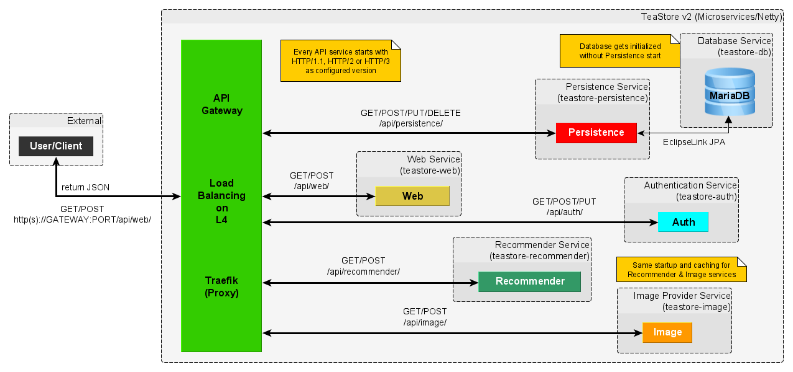

# TeaStore v2 (HTTP/1.1 | HTTP/2 | HTTP/3)

TeaStore v2 is a rework of the original
[TeaStore](https://se.informatik.uni-wuerzburg.de/software-engineering-group/tools/teastore/)
and part of my master thesis.  
The original version was developed by the Descartes Research Group (University of Würzburg).  
TeaStore emulates a basic web store for automatically generated, tea and tea supplies.   
For more details visit the [base repository](https://github.com/DescartesResearch/TeaStore).

## Changes
- Registry replaced with [Traefik](https://github.com/traefik/traefik),
  a HTTP reverse proxy and load balancer
- Netty HTTP servers (and client) instead of Jetty servlets
- Support for HTTP/1.1, HTTP/2 and HTTP/3 (HTTP/3 on UNIX only)
- Full JSON-API instead of JSPs
- Optimized API paths
- The database setup includes the data population
- Java 17 (LTS) as target environment

## Getting Started
### Launch without installation
### Docker Compose
#### HTTP/1.1
 ```sh
 docker-compose up -f ./examples/docker/docker-compose_http1_1.yaml up
 ```
#### HTTP/2
 ```sh
 docker-compose up -f ./examples/docker/docker-compose_http2.yaml up
 ```
#### HTTP/3
 ```sh
docker-compose -f ./examples/docker/docker-compose_http3.yaml up
 ```

### Launch locally with installation
#### Prerequisites
Install dependencies (second command can be ignored for docker-compose run).
 ```sh
mvn clean install
docker build -t teastore-db:v2 database
 ```

#### Only database as Docker container
You have to start the database first.
 ```sh
docker run -p 3306:3306 teastore-db:v2
 ```
Run services in order:
- HttpPersistenceServer
- HttpAuthServer
- HttpWebServer

Wait until database is ready before starting the next services.

- HttpImageServer
- HttpRecommenderServer

#### Docker Compose
Waiting for the database is already included.
#### HTTP/1.1
 ```sh
 docker-compose up --build
 ```
#### HTTP/2
 ```sh
 docker-compose up -f ./docker-compose_h2.yaml up --build
 ```
#### HTTP/3
 ```sh
 docker-compose up -f ./docker-compose_h3.yaml up --build
 ```

## DockerHub Images
### API Gateway & Services
- [Traefik](https://hub.docker.com/_/traefik)
- [Database](https://hub.docker.com/r/tvsjsdock/teastore-db)
- [Persistence](https://hub.docker.com/r/tvsjsdock/teastore-persistence)
- [Auth](https://hub.docker.com/r/tvsjsdock/teastore-auth)
- [Web](https://hub.docker.com/r/tvsjsdock/teastore-web)
- [Image](https://hub.docker.com/r/tvsjsdock/teastore-image)
- [Recommender](https://hub.docker.com/r/tvsjsdock/teastore-recommender)
### Tools
- [curl-http3](https://hub.docker.com/repository/docker/tvsjsdock/curl-http3)
- [h2load-http3](https://hub.docker.com/r/tvsjsdock/h2load-http3)

## Microservice Architecture


### API Documentation 
Available as [OpenAPI v3 YAML](api/TeaStore_v2.yaml).

## Evaluation (Benchmarking)
### Tools
#### curl
The popular command-line tool supports all HTTP versions.  
You can use the DockerHub image if you don't want to compile it on your system.  
Since it was not designed for HTTP benchmarks,
you could use [liburl](https://curl.se/libcurl/) to write your own benchmarking tool.

#### h2load
[h2load](https://github.com/nghttp2/nghttp2/tree/quic#running-h2load-against-http3-server)
is currently (08/21) the only HTTP benchmarking tool which supports HTTP/1.1,
HTTP/2 and HTTP/3.
You can use the existing [benchmark script](examples/h2load_benchmark.sh) or
create your own scripts.

## License
Distributed under the Apache-2.0 License. See `LICENSE` for more information.  
If you use this application in a scientific context,
please consider the [citation rules](https://github.com/DescartesResearch/TeaStore#cite-us).
